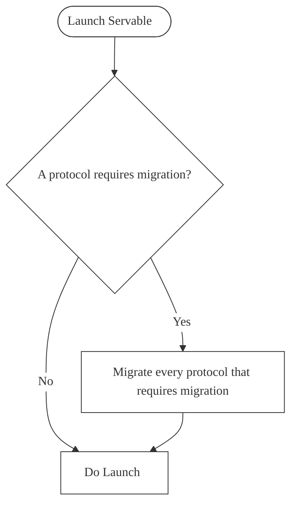

# Publishable *protocol for Servable*


**@servable-community/publishable**


[](https://www.npmjs.org/package/@servable-community/publishable) [](https://npmjs.org/package/@servable-community/publishable) [](https://github.com/servable-community/publishable/actions/tests.yml) [](https://opensource.org/licenses/MIT) [](https://standardjs.com)


## A complete lifecycle management for publication


Allow any object to be in a published or drafted state.

Lorem Ipsum is simply dummy text of the printing and typesetting industry. Lorem Ipsum has been the industry's standard dummy text ever since the 1500s, when an unknown printer took a galley of type and scrambled it to make a type specimen book. It has survived not only five centuries, but also the leap into electronic typesetting, remaining essentially unchanged. It was popularised in the 1960s with the release of Letraset sheets containing Lorem Ipsum passages, and more recently with desktop publishing software like Aldus PageMaker including versions of Lorem Ipsum.





### Available in Servable registry


@servable-community/publishable is available at [servable registry](https://registry.servablecommunity.com/protocol/@servable-community/publishable).


**Use in your servable project:**

```bash
yo servable -t useprotocol --protocolid @servable-community/publishable
```

## Install

```bash
yarn add @servable-community/publishable
```


or

```bash
npm install @servable-community/publishable
```

### Companion packages


### Dependencies

#### Target classes


#### Managed classes

##### Applies to classes: *commentableEntry*


## Usage

### Template


Add this template to your class' protocols.json file. Fill the values to fit your needs with the right parameters.

```json
{
  "id": "publishable",
  "name": "Publishable",
  "slug": "",
  "params": {}
}
```

### Parameters

| type | id  | Message | Default value | vacuity |
| ---- | --- | ------- | ------------- | ------- |
| input | waitForValidation | Wait for validation |  | optional |
| input | errorMessage | Error message | Could not publish | mandatory |
| input | notifyOnError | Notify on error |  | mandatory |

## Seed

## Protocol class

## Before init

## After init

## Config

## Functions

## Live Classes

## Schema

#### Target class


**Fields**

| Name | Type | Target class | Default value |
| ---- | ---- | ------------ | ------------- |
| publishableStatus | String |  |  |


**Class Level Permissions**

| Name | Content |
| ---- | ------- |
| protectedFields | {"*":[]} |


**Indexes**

| Name | Content |
| ---- | ------- |
| _publishableStatus | {"publishableStatus":1} |

## System

## Lib

## Triggers

## Resources

### Servable Documentation


You can find here the complete [servable documentation](https://documentation.servablecommunity.com/) with guides and api reference.

### Servable Registry


You can find other Servable  protocols at the [Servable registry](https://registry.servablecommunity.com/)

### License


MIT © [servable-community](https://github.com/servable-community)
